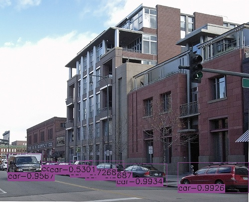
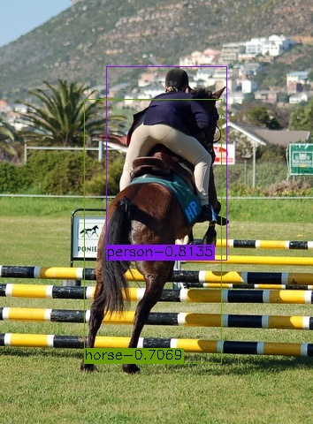
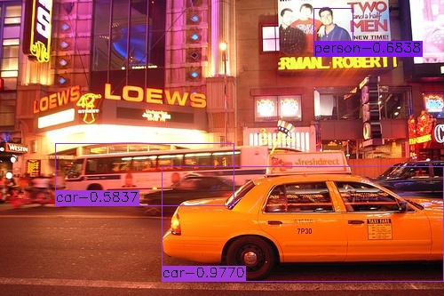

# EfficientDet
This is an implementation of [EfficientDet](https://arxiv.org/pdf/1911.09070.pdf) for object detection on Keras and Tensorflow. The project is based on [fizyr/keras-retinanet](https://github.com/fizyr/keras-retinanet)
and the [qubvel/efficientnet](https://github.com/qubvel/efficientnet). 
The pretrained EfficientNet weights files are downloaded from [Callidior/keras-applications/releases](https://github.com/Callidior/keras-applications/releases)

Thanks for their hard work.
This project is released under the Apache License. Please take their licenses into consideration too when use this project.

## Train
### build dataset (Pascal VOC, other types please refer to [fizyr/keras-retinanet](https://github.com/fizyr/keras-retinanet))
* Download VOC2007 and VOC2012, copy all image files from VOC2007 to VOC2012.
* Append VOC2007 train.txt to VOC2012 trainval.txt.
* Overwrite VOC2012 val.txt by VOC2007 val.txt.
### train
* STEP1: `python3 train.py --snapshot imagenet --phi {0, 1, 2, 3, 4, 5, 6} --gpu 0 --random-transform --compute-val-loss --freeze-backbone --batch-size 32 --steps 1000 pascal datasets/VOC2012` to start training. The init lr is 1e-3.
* STEP2: `python3 train.py --snapshot xxx.h5 --phi {0, 1, 2, 3, 4, 5, 6} --gpu 0 --random-transform --compute-val-loss --freeze-bn --batch-size 4 --steps 10000 pascal datasets/VOC2012` to start training when val mAP can not increase during STEP1. The init lr is 1e-4 and decays to 1e-5 when loss stops dropping down.
## Evaluate
* `python3 eval/common.py` to evaluate by specifying model path there.
* The best evaluation results (score_threshold=0.01, mAP50) on VOC2007 test are: 

=======

| phi | 0 | 1 |

| ---- | ---- | ---- |

| w/o weighted |  | [0.8029](https://drive.google.com/open?id=1-QkMq56w4dZOTQUnbitF53NKEiNF9F_Q) |

| w/ weighted | [0.7661](https://drive.google.com/open?id=1lM5C5csv-5CBWQwgnVK7vcCFRkfjDELk) |  |

## Test
`python3 inference.py` to test your image by specifying image path and model path there. 

 

### Coco 2017
I performed a training in 2 steps, as described above, on the Coco 2017 dataset. The first step converged around 33 epochs, second step I let run to the end (50 epochs) but converged around epoch 40.

Evaluating on Coco 2017 validation set gave the following accuracy results:

Average Precision (AP) @[ IoU=0.50:0.95 | area= all | maxDets=100 ] = 0.245

Average Precision (AP) @[ IoU=0.50 | area= all | maxDets=100 ] = 0.390

Average Precision (AP) @[ IoU=0.75 | area= all | maxDets=100 ] = 0.258

Average Precision (AP) @[ IoU=0.50:0.95 | area= small | maxDets=100 ] = 0.083

Average Precision (AP) @[ IoU=0.50:0.95 | area=medium | maxDets=100 ] = 0.276

Average Precision (AP) @[ IoU=0.50:0.95 | area= large | maxDets=100 ] = 0.405

Average Recall (AR) @[ IoU=0.50:0.95 | area= all | maxDets= 1 ] = 0.242

Average Recall (AR) @[ IoU=0.50:0.95 | area= all | maxDets= 10 ] = 0.377

Average Recall (AR) @[ IoU=0.50:0.95 | area= all | maxDets=100 ] = 0.397

Average Recall (AR) @[ IoU=0.50:0.95 | area= small | maxDets=100 ] = 0.113

Average Recall (AR) @[ IoU=0.50:0.95 | area=medium | maxDets=100 ] = 0.467

Average Recall (AR) @[ IoU=0.50:0.95 | area= large | maxDets=100 ] = 0.647

This implies this implementation has still a gap in accuracy with the paper implementation (24.5% vs 32.4%).

## Detect
A script is avalable to perform detections with a (self) trained model. It could be used as follows:
`python3 detector.py --model model.h5 --phi=0 --threshold=0.5 --image image.jpg`
